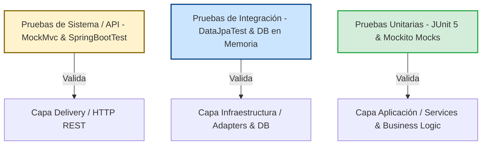

# Proceso de Pruebas Unitarias y de Integración

Este documento detalla la estrategia, arquitectura y ejecución de las pruebas implementadas en el proyecto de gestión de inventarios. El proyecto sigue un diseño de **Arquitectura Hexagonal (Puertos y Adaptadores)**, lo cual permite estructurar las pruebas de forma alineada a la responsabilidad de cada capa.

---

## Tabla de Contenidos
1. [Estructura del Proyecto y Alineación de Pruebas](#1-estructura-del-proyecto-y-alineación-de-pruebas)
2. [Pirámide de Pruebas](#2-pirámide-de-pruebas)
3. [Pruebas Unitarias (Capa de Aplicación)](#3-pruebas-unitarias-capa-de-aplicación)
4. [Pruebas de Integración (Capa de Infraestructura)](#4-pruebas-de-integración-capa-de-infraestructura)
5. [Pruebas de Sistema / E2E (Capa de Entrada/API)](#5-pruebas-de-sistema--e2e-capa-de-entradaapi)
6. [Cómo Ejecutar las Pruebas](#6-cómo-ejecutar-las-pruebas)
7. [Buenas Prácticas de Pruebas](#7-buenas-prácticas-de-pruebas)

---

## 1. Estructura del Proyecto y Alineación de Pruebas

El código fuente está organizado en capas limpias con responsabilidades delimitadas:

*   **`domain`**: Modelos de negocio (`Product`, `Category`, `Location`) y Puertos de Salida (`ProductRepositoryPort`, etc.).
*   **`application`**: Casos de uso y servicios (`ProductService`, etc.) que coordinan la lógica del negocio.
*   **`infrastructure`**: Adaptadores que implementan los puertos (`ProductRepositoryAdapter`) conectándose a bases de datos relacionales usando Spring Data JPA (`ProductJpaRepository`).
*   **`delivery`**: Controladores REST (`ProductController`, etc.) que exponen los endpoints HTTP del sistema.

Las pruebas se agrupan en `src/test/java/edu/unisabana/proyecto/` bajo tres paquetes estratégicos que corresponden a la Pirámide de Pruebas:
1.  **`unit`**: Valida las reglas de negocio en la capa de **Aplicación**.
2.  **`integration`**: Valida la interacción con la base de datos en la capa de **Infraestructura**.
3.  **`system`**: Valida los flujos de extremo a extremo a través de la capa de **Delivery/API**.

---

## 2. Pirámide de Pruebas



---

## 3. Pruebas Unitarias (Capa de Aplicación)

Las pruebas unitarias se enfocan en comprobar la lógica de los servicios (`ProductService`, `CategoryService`, `LocationService`) de manera aislada. 

*   **Tecnologías**: JUnit 5, Mockito.
*   **Aislamiento**: Se simula el comportamiento de los puertos de persistencia (como `ProductRepositoryPort`) usando mocks. Esto evita la necesidad de configurar la base de datos o levantar el contexto de Spring, logrando ejecuciones ultra rápidas.

### Ejemplo de Implementación (`ProductServiceTest.java`)

```java
@ExtendWith(MockitoExtension.class) // O inicializado en @BeforeEach
class ProductServiceTest {

    @Mock
    private ProductRepositoryPort productRepository; // Simulación del puerto de salida

    @InjectMocks
    private ProductService productService; // Inyección de la clase bajo prueba

    @BeforeEach
    void setUp() {
        MockitoAnnotations.openMocks(this);
    }

    @Test
    void createProduct_ShouldReturnSavedProduct() {
        // GIVEN: Datos iniciales y comportamiento simulado
        Product product = new Product(null, "Test", "Desc", 10.0, 5, 1L, 1L);
        Product savedProduct = new Product(1L, "Test", "Desc", 10.0, 5, 1L, 1L);
        when(productRepository.save(any(Product.class))).thenReturn(savedProduct);

        // WHEN: Ejecución de la acción
        Product result = productService.createProduct(product);

        // THEN: Verificación de resultados
        assertNotNull(result.getId());
        assertEquals("Test", result.getName());
        verify(productRepository, times(1)).save(product); // Verifica interacción
    }

    @Test
    void getProduct_WhenNotExists_ShouldThrowException() {
        // GIVEN: Simular que el producto no existe en el repositorio
        when(productRepository.findById(1L)).thenReturn(Optional.empty());

        // WHEN & THEN: Asegura que se lance la excepción correcta
        assertThrows(RuntimeException.class, () -> productService.getProduct(1L));
    }
}
```

---

## 4. Pruebas de Integración (Capa de Infraestructura)

Validan que el adaptador de infraestructura (`ProductRepositoryAdapter`) traduzca correctamente los datos del dominio a entidades de base de datos (`ProductEntity`) y se comunique sin fallos con Spring Data JPA.

*   **Tecnologías**: JUnit 5, `@DataJpaTest` de Spring Boot.
*   **Base de Datos**: Usa una base de datos embebida/en memoria (como H2).
*   **Comportamiento**: `@DataJpaTest` levanta únicamente los componentes de persistencia de Spring (JPA, EntityManager, Repositorios) para velocidad óptima, y realiza automáticamente un **Rollback** de cada transacción al finalizar cada test para mantener la base de datos limpia.

### Ejemplo de Implementación (`ProductRepositoryAdapterTest.java`)

```java
@DataJpaTest // Configura el contexto de JPA y base de datos en memoria
class ProductRepositoryAdapterTest {

    @Autowired
    private ProductJpaRepository jpaRepository; // Repositorio JPA real

    @Test
    void save_ShouldPersistAndReturnDomain() {
        // GIVEN: El adaptador y una entidad de dominio a guardar
        ProductRepositoryAdapter adapter = new ProductRepositoryAdapter(jpaRepository);
        Product product = new Product(null, "IntegrationTest", "Desc", 15.0, 2, 1L, 1L);

        // WHEN: Guardado a través de adaptador
        Product saved = adapter.save(product);

        // THEN: Validar que el objeto de dominio retornado tenga ID
        assertNotNull(saved.getId());
        assertEquals("IntegrationTest", saved.getName());
        
        // Verificar que realmente se guardó en la base de datos JPA
        Optional<ProductEntity> entity = jpaRepository.findById(saved.getId());
        assertTrue(entity.isPresent());
        assertEquals("IntegrationTest", entity.get().getName());
    }
}
```

---

## 5. Pruebas de Sistema / E2E (Capa de Entrada/API)

Prueban el flujo completo de la aplicación levantando el contexto web completo y simulando llamadas a la API REST.

*   **Tecnologías**: `@SpringBootTest`, `@AutoConfigureMockMvc`, `MockMvc`.
*   **Aislamiento**: Ninguno. Se prueba desde el Controller, pasando por el Service, hasta la persistencia en base de datos.
*   **Propósito**: Asegurar la correcta serialización/deserialización de JSON, validaciones de los controladores (`@Valid`), enrutamiento HTTP, códigos de estado (201 Created, 200 OK, 404 Not Found) y manejo global de excepciones.

### Ejemplo de Implementación (`ProductControllerTest.java`)

```java
@SpringBootTest // Carga el contexto completo de la aplicación Spring
@AutoConfigureMockMvc // Configura el cliente MockMvc
class ProductControllerTest {

    @Autowired
    private MockMvc mockMvc;

    @Autowired
    private ObjectMapper objectMapper;

    @Test
    void shouldCreateAndRetrieveProduct() throws Exception {
        // 1. Crear producto via POST y verificar código 201 Created
        Product productToCreate = new Product(null, "SystemTestProduct", "Desc", 100.0, 20, 1L, 1L);
        String productJson = objectMapper.writeValueAsString(productToCreate);

        MvcResult result = mockMvc.perform(post("/api/products")
                .contentType(MediaType.APPLICATION_JSON)
                .content(productJson))
                .andExpect(status().isCreated())
                .andExpect(jsonPath("$.id").exists())
                .andExpect(jsonPath("$.name").value("SystemTestProduct"))
                .andReturn();

        // Extraer ID autogenerado
        String responseString = result.getResponse().getContentAsString();
        Product createdProduct = objectMapper.readValue(responseString, Product.class);

        // 2. Recuperar el producto creado via GET y verificar código 200 OK
        mockMvc.perform(get("/api/products/" + createdProduct.getId()))
                .andExpect(status().isOk())
                .andExpect(jsonPath("$.name").value("SystemTestProduct"));
                
        // 3. Eliminar el producto via DELETE y verificar código 244 No Content
        mockMvc.perform(delete("/api/products/" + createdProduct.getId()))
                .andExpect(status().isNoContent());
    }
}
```

---

## 6. Cómo Ejecutar las Pruebas

El ciclo de ejecución de pruebas está gestionado mediante Apache Maven. Puedes ejecutar las pruebas usando los siguientes comandos desde la raíz del proyecto:

### Ejecutar todas las pruebas (Unitarias, Integración y Sistema)
```bash
mvn test
```

### Ejecutar únicamente un paquete específico
*   **Pruebas Unitarias**:
    ```bash
    mvn test -Dtest=edu.unisabana.proyecto.unit.*
    ```
*   **Pruebas de Integración**:
    ```bash
    mvn test -Dtest=edu.unisabana.proyecto.integration.*
    ```
*   **Pruebas de Sistema**:
    ```bash
    mvn test -Dtest=edu.unisabana.proyecto.system.*
    ```

### Ejecutar una clase de prueba específica
```bash
mvn test -Dtest=ProductServiceTest
```

### Limpiar compilaciones anteriores y volver a ejecutar pruebas
```bash
mvn clean test
```

---

## 7. Buenas Prácticas de Pruebas

Para garantizar que la suite de pruebas sea mantenible, rápida y confiable, se aplican las siguientes directrices:

1.  **Independencia**: Los casos de prueba no deben depender del estado dejado por otros tests. Cada prueba debe configurar sus propios datos (`GIVEN`).
2.  **Convención de Nombres**: Usar nombres descriptivos que expliquen la acción y la expectativa. Por ejemplo: `should[Acción]_[BajoCondición]`, e.g., `getProduct_WhenNotExists_ShouldThrowException`.
3.  **Patrón Triple A (AAA)**:
    *   **Arrange (Organizar)**: Preparar los mocks y el estado del objeto a probar.
    *   **Act (Actuar)**: Invocar el método o acción que se está probando.
    *   **Assert (Afirmar)**: Comprobar que el resultado y las interacciones con los mocks coinciden con lo esperado.
4.  **Mantenimiento de Limpieza de DB**: En pruebas de integración, usar `@DataJpaTest` garantiza transaccionalidad automática. En pruebas de sistema (`@SpringBootTest`), si se guardan datos persistentes de forma manual sin transacciones automáticas, asegurar limpiarlos en métodos anotados con `@AfterEach`.
5.  **Evitar Hardcoding**: Emplear constructores limpios o patrones Builder para instanciar objetos del dominio y entidades en los tests de manera que si cambia la estructura de datos, solo se modifique en un punto central.

---

## 8. Cobertura de Código (JaCoCo) y Lombok

Para lograr una cobertura de código precisa y confiable (superior al **90%**), el proyecto implementa dos estrategias combinadas:

### A. Exclusión de Código Autogenerado por Lombok
Probar métodos autogenerados como getters, setters, `equals()`, `hashCode()` y `toString()` añade complejidad innecesaria a las pruebas sin aportar valor al negocio. Para resolver esto:
*   Se configuró el archivo `lombok.config` en la raíz del proyecto con la directiva:
    ```properties
    lombok.addLombokGeneratedAnnotation = true
    ```
*   Esto añade de forma automática la anotación `@lombok.Generated` a todo el código generado por Lombok.
*   El motor de **JaCoCo** detecta esta anotación y **excluye** automáticamente dichos métodos del cálculo de cobertura de código.

### B. Cobertura de Clases y Casos Especiales
*   Se crearon suites de pruebas unitarias específicas ([DomainModelsTest](file:///d:/Luis%20Beltran/Development/Maestria_Ingenieria_Software/TestingSoftware/InventoryTesting/src/test/java/edu/unisabana/proyecto/unit/DomainModelsTest.java) y [EntityModelsTest](file:///d:/Luis%20Beltran/Development/Maestria_Ingenieria_Software/TestingSoftware/InventoryTesting/src/test/java/edu/unisabana/proyecto/unit/EntityModelsTest.java)) para comprobar constructores adicionales e instanciaciones.
*   Se completaron los métodos faltantes en pruebas de adaptadores (`findAll`, `deleteById`) y de controladores REST, logrando cubrir el **100%** de las instrucciones analizables de la aplicación.

---

## 9. Índice de Documentación Centralizada

A continuación se listan los documentos adicionales relacionados con el proyecto, centralizados para facilitar su acceso:

*   **[Inicio / Home](./wiki/Home.md)**: Descripción del dominio, diagrama de arquitectura e información del equipo.
*   **[Pruebas Unitarias](./wiki/Pruebas_Integracion.md)**: Nota: el nombre del archivo es Integración pero corresponde al enfoque documentado. *(Por favor revisar archivos específicos como [Pruebas de Sistema](./wiki/Pruebas_Sistema.md) y [Pruebas de Rendimiento](./wiki/Pruebas_Rendimiento.md) para más detalles).*
*   **[Resultados de Cobertura](./wiki/Cobertura_Resultados.md)**: Evidencias y métricas de la cobertura de código.
*   **[Registro de Defectos](./wiki/Registro_Defectos.md)**: Listado de defectos encontrados, incluyendo severidad, prioridad y estado.
*   **[Defectos de Integración](./wiki/defectos_integracion.md)**: Detalles sobre errores específicos identificados durante las pruebas de integración.
*   **[Otros Defectos (Raíz)](./defectos.md)**: Notas y registros adicionales de defectos a nivel general.
*   **[Conclusiones](./wiki/Conclusiones.md)**: Reflexiones finales, análisis de resultados y mejoras propuestas.


