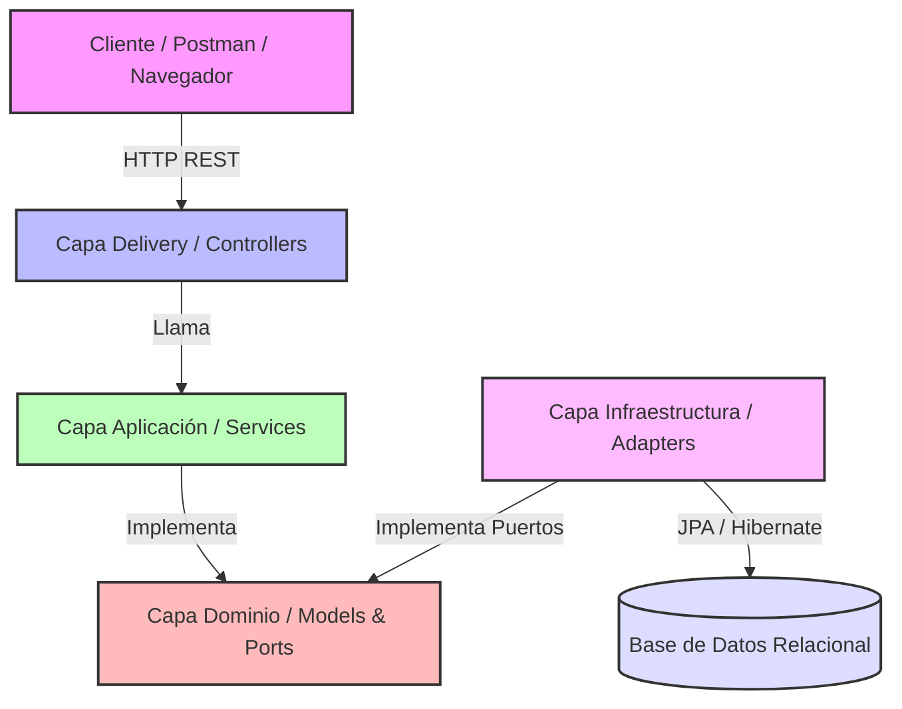

# 1. Inicio

## a) Descripción del dominio y propósito del sistema
El proyecto consiste en un sistema de gestión de inventarios que permite la administración de **Productos**, **Categorías** y **Ubicaciones** (Locations). El propósito de la aplicación es proveer operaciones CRUD para estas entidades garantizando la integridad de los datos, reglas de negocio y un manejo adecuado del almacenamiento de la información de inventario en una base de datos relacional. Está desarrollado usando Spring Boot bajo una Arquitectura Hexagonal que separa las reglas de negocio de la infraestructura y el punto de entrada REST.

## b) Diagrama de arquitectura
El proyecto sigue un diseño de **Arquitectura Hexagonal (Puertos y Adaptadores)**.

## c) Integrantes del equipo
* Luis Fernando Beltran
* Roberto Jose Breuer
